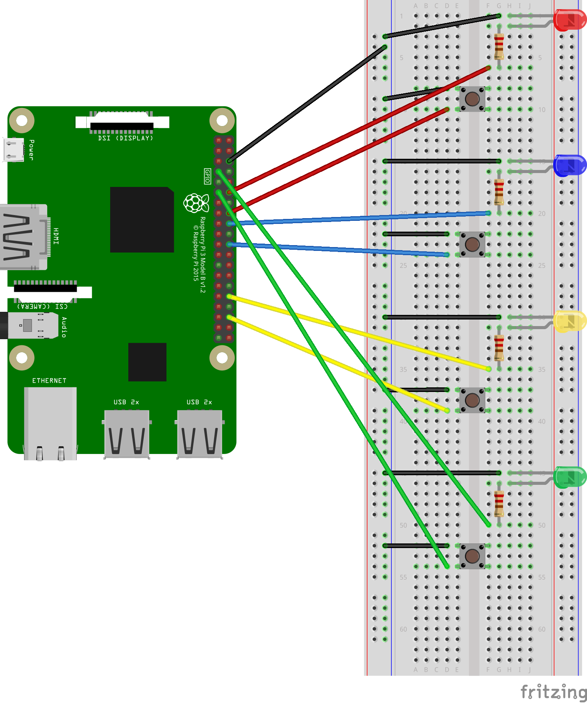

# Genial game
Genial, a Simon-like game for Raspberry Pi written in Python.
## Introduction
Genial is a simple game written in Python and designed for Raspberry Pi. It is similar to [Simon](https://en.wikipedia.org/wiki/Simon_(game)), a popular electronic game during the 1980s, in which the player has to repeat the sequence of lights and sounds generated by the device. However, there are some differences between Genial and Simon, e.g., Genial does not emit sound. If you would like to include this and other Simon features to the game, feel free to change the code and submit an issue with your suggestion after testing in your Raspberry Pi.
## Getting started
### Technologies
- Python3
- GPIO Zero
### Component list
- Raspberry Pi x1
- Breadboard x1
- Jumper wire male to male x8
- Jumper wire male to female x9
- LED x4 (red, blue, yellow and green)
- 220Ω (ohms) resistor x4
- Push button x4 (square buttons with colourful caps are preferable but not essential)
### Wiring diagram

If you need some help to attach the wires to your Raspberry Pi, check this [website](https://pinout.xyz/).
## Installing
### GPIO Zero
If you are using Raspbian or the Raspberry Pi Desktop, GPIO Zero is installed by default. But if you are using Raspbian Lite or other operating system, click [here](https://gpiozero.readthedocs.io/en/stable/installing.html) to install this library.
### Game
#### Cloning the repository
You need to have git installed on your Raspberry Pi in order to clone this repository. If you are not sure whether you have git installed or not, open the command line and type `git --version`. 
If you already have git installed but a newer version is available, use the command `git clone https://github.com/git/git`' to update it.
But if you do not have git installed on your computer, type `sudo apt-get install git`.
To install the game, use the command `cd` and write the directory in which you want to save the repository. If you do not know where you want to save the repository, type `pwd` and check if the output is `/home/pi`. If it is, you do not need to change the directory; you can save the repository right there. To find the file later, you will only need to open the file manager.
To conclude, clone the repository using `git clone https://github.com/LFuciarelli/genial-game.git` and open the game using the commands `cd genial-game` and `python genial.py`.
#### Downloading a ZIP file
If you do not know how to use the command line, you can download the project in ZIP format by clicking on the green button `Clone or download` on the top of the main page. After extracting the files, open genial.py in a text editor or in a Python IDE and run the code.

Now you are ready to start playing Genial :blush:!
## How to play
The game starts at level 1, in which one of the four LEDs turns on for one second. When it turns off again, the player has to push the button of the corresponding LED. If the player replicates the sequence correctly, all the LEDs will pulse and the player will pass to the next level, in which the computer will add another LED to the sequence or will repeat the same LED another time. Otherwise, only the red LED will pulse and the player will have to repeat the level. To leave the game, press Ctrl + C.
## License
This project is licensed under the MIT License - open the [LICENSE.md](https://github.com/LFuciarelli/genial-game/blob/master/LICENSE.md) file for more details
